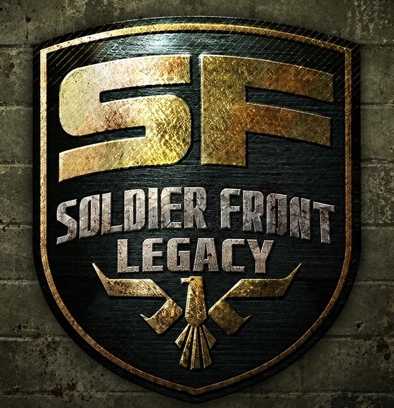
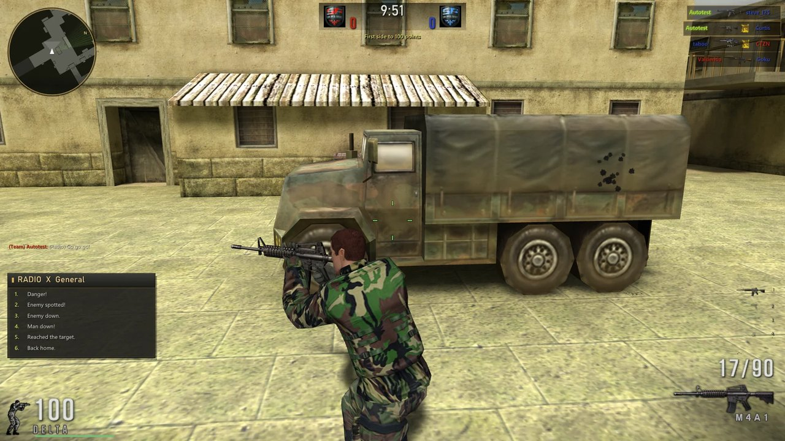
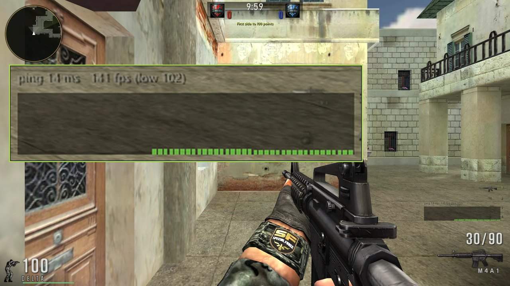
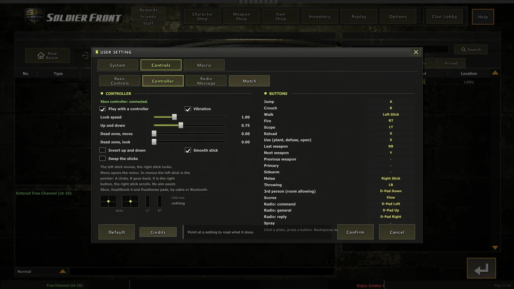
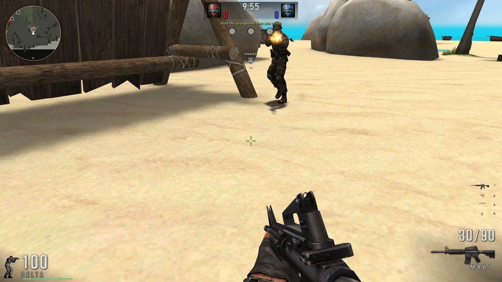
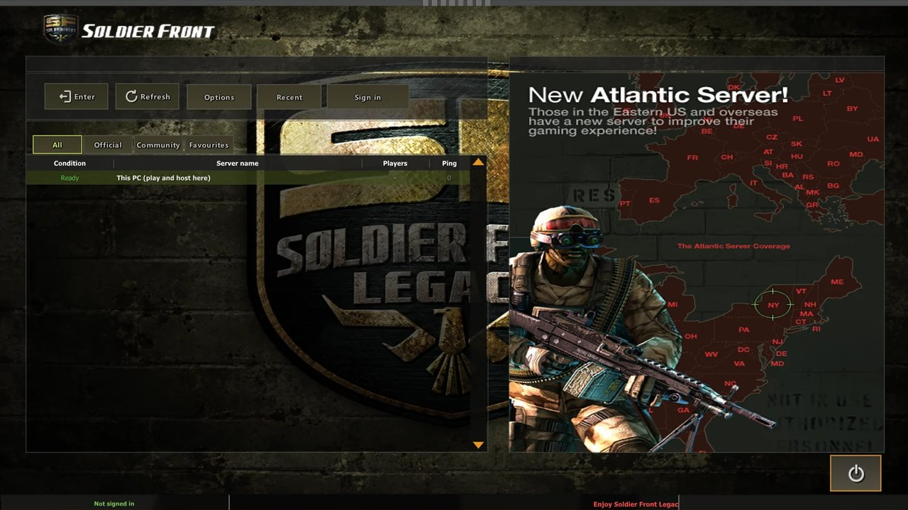
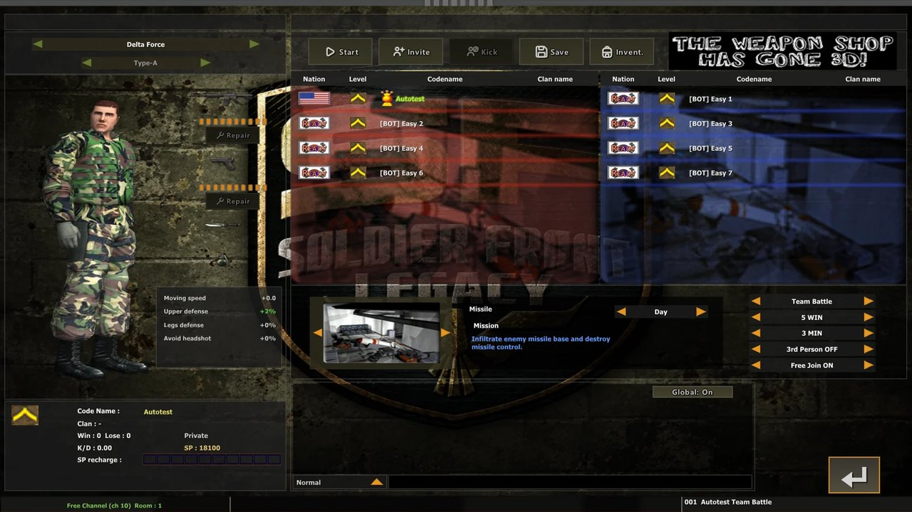
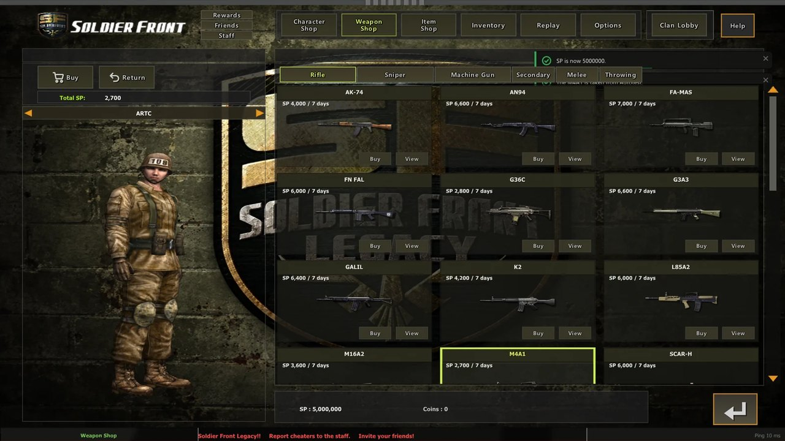
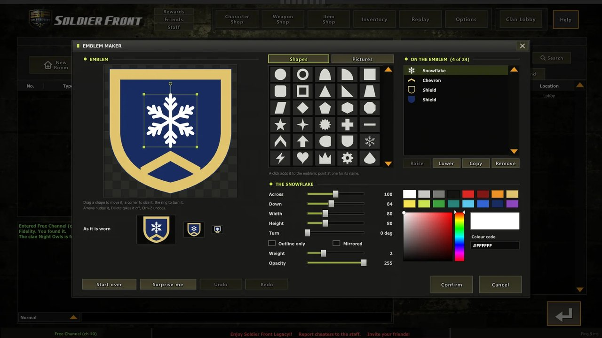
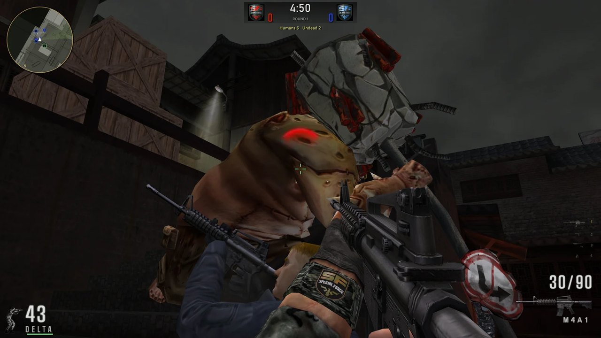

<div align="center">



# Soldier Front Legacy

<p><em>Soldier Front, reconstructed: a new game that plays the original's maps, weapons and soldiers, at any frame rate, with a controller or a mouse, on Windows, Linux, macOS and Android</em></p>

<a href="#">

</a>

<br/>

[](https://en.cppreference.com/w/cpp/23)
[](#-building)
[](#-building)
[](#-other-systems)
[](#-other-systems)
[](vendor/VanGUI/BUILD-INFO.md)
[](https://teamvanilla.dev)

<br/>

[](../../stargazers)
[](../../issues)
[](../../commits)
[](https://sf.teamvanilla.dev)

<br/>

[](#-features-at-a-glance)
[](#-features-at-a-glance)
[](#-playing)
[](#-features-at-a-glance)
[](#-features-at-a-glance)
[](#-features-at-a-glance)
[](#-the-server)

</div>


**Soldier Front** is the tactical online shooter Dragonfly made in Korea as *Special Force* (2004), which North America played on ijji and then Aeria Games. **Soldier Front Legacy** is TeamVanilla's reconstruction of it: a new program, `legacysf.exe`, that plays Soldier Front's own 40 maps, 82 weapons, ['ARTC', 'Delta Force', 'ROKMC', 'KSF', 'SAS', 'GSG-9', 'GIGN', 'Spetsnaz', 'SRG', 'Force Recon', 'PSU', 'Mulan'] forces, sounds and lobby art, read in place from a player's own Soldier Front installation. The program around them is new: the renderer, the menus, the netcode, the rules and the options.

It draws with **DirectX 12** (DirectX 11 and OpenGL as fallbacks) on Windows 10 and 11, with OpenGL ES 3 on Android, Linux and macOS, at whatever frame rate the player chooses, and plays with a keyboard and mouse or an **Xbox, DualShock 4 or DualSense controller**. Players sign in once with a **Team Vanilla account** and keep one rank and record on every server, Team Vanilla's or anyone's. The server is its own repository: [Soldier Front Legacy Server](https://github.com/tsyvm/soldierfrontlegacy-server).

Ready-to-play downloads for Windows, Linux and Android, and the guide for players and server owners, are at **[sf.teamvanilla.dev](https://sf.teamvanilla.dev)**.

<p align="center">



<br/>



<br/>



<br/>
<sub>Taken from the game itself on DirectX 12 at 1920 x 1080, by its own automated walk through every screen.</sub>
</p>

<div align="center">

### 📑 Contents

[Features](#-features-at-a-glance) · [Legacy and the Original](#-legacy-and-the-original) · [Playing](#-playing) · [Requirements](#-requirements)

[Building](#-building) · [Other Systems](#-other-systems) · [The Server](#-the-server) · [Repository Layout](#-repository-layout)

[Known Limitations](#-known-limitations) · [Credits and Ownership](#-credits-and-ownership) · [Links](#-links)

</div>


## ✨ Features at a Glance

**Past the old frame cap**
- **Your frame rate**: the original holds itself to 32 frames a second; Legacy has no cap of its own. The limit is yours, from 30 to 360, 144 to begin with, and vertical sync is a switch
- **Three renderers on Windows**: DirectX 12 first, then DirectX 11, then OpenGL (through ANGLE); one that cannot start hands over to the next and says so
- **Any screen**: real pixels at any Windows scaling, a window or borderless full screen, in 4:3, 5:4, 16:10, 16:9 or 21:9, stretched as the original was or kept in shape between bars
- **Anti-aliasing** at 2x, 4x or 8x and texture filtering up to 16x

**Controllers as well as the mouse**
- **Xbox controllers** (anything XInput), the **DualShock 4** and the **DualSense**, by cable or Bluetooth
- Every action is a button you set as you set a key; in the menus the left stick is the pointer, so every lobby page works without a mouse
- Look speed, dead zones, invert, a smooth or a linear stick, and vibration for hits, blasts and shots
- **No aim assist**: a controller plays the same match as a mouse, on the same terms

**The whole game**
- **All 12 game types** of the original's waiting room, each played by its own rules: Team Battle with its Destroy, Take Back, Escape and Dual missions, Team Deathmatch, Single Battle, Sniper Mode, Capture the Captain, Captain Mode, Horror Mode, Horror Mode 2, Team Slayer, Occupy, Pirate Mode and Training
- **Bots** fill a room and play the objective: they plant and defuse, carry the item home, take the consoles and the strongholds
- **The lobby as it was**: the server and channel lists, rooms, the Weapon, Character and Item Shops, capsules, clans and their emblems, friends, whispers and mail
- **Rewards and events**: sign-in days, hours of play, three quests a day, Duffle Bags and gift boxes
- **Replays**: every match the server keeps, watched again behind any soldier, wound on or back along its time line

**One account on every server**
- A **Team Vanilla account** made in the game: a username and a password, no email address
- Rank, record, SP, Coins, weapons, clan, friends and mail follow you to every server, official or community
- A server never sees your password: your game shows it a short-lived ticket that Team Vanilla signed
- **This PC**: a server of your own, inside the game, for bots or friends on your network

**The same game for everyone**
- Base weapons, forces and parts keep their official numbers on every server: an owner can add, nobody can rebalance
- Team Vanilla checks every match report, and one that could not have happened is refused
- A map keeps its own light, hour and sky, and smoke and flash-bangs are drawn in full: no option thins them


## 🧭 Legacy and the Original

| | The original `soldierfront.exe` | **`legacysf.exe`** |
|---|---|---|
| **Frame rate** | Held to 32 frames a second | **No cap of its own: 30 to 360, 144 to begin with** |
| **Graphics** | Direct3D 9 | **DirectX 12, DirectX 11 or OpenGL on Windows; OpenGL ES 3 elsewhere** |
| **Controllers** | None | **Xbox (XInput), DualShock 4, DualSense; touch on Android** |
| **Servers** | Its publisher's own | **Team Vanilla's, anyone's, and This PC on your own machine** |
| **Runs on** | Windows | **Windows 10 and 11, Linux, macOS (Apple Silicon), Android 8 and newer** |
| **The data** | Its own archives | **The same files, read in place from your installation** |
| **Installing** | A launcher and a patcher | **Drag it into your Soldier Front folder and run it** |


## 🎮 Playing

Download the game from **[sf.teamvanilla.dev](https://sf.teamvanilla.dev/download/)**. On Windows, drag everything in the zip into your Soldier Front folder (the one holding `data`) and run `legacysf.exe` there: nothing of Soldier Front's own is replaced, and nothing is installed. Make a Team Vanilla account in the game, make your soldier, pick a server.

The keys are the original's own, from its `config.cfg`; the controller's buttons are ours, since the original had none. Every one can be set again in **Options, Controls**.

| Action | Key | Xbox | PlayStation |
|---|---|---|---|
| Forward, back, left, right | <kbd>W</kbd> <kbd>S</kbd> <kbd>A</kbd> <kbd>D</kbd> | left stick | left stick |
| Look | the mouse | right stick | right stick |
| Jump | <kbd>Space</kbd> | A | Cross |
| Crouch | <kbd>Left Shift</kbd> | B | Circle |
| Walk | <kbd>Left Ctrl</kbd> | left stick, clicked | L3 |
| Fire · Scope | left button · right button | RT · LT | R2 · L2 |
| Reload | <kbd>R</kbd> | X | Square |
| Use: plant, defuse, open, take | <kbd>E</kbd> | X, held | Square, held |
| Primary · sidearm · melee | <kbd>1</kbd> <kbd>2</kbd> <kbd>3</kbd> | | |
| Throwables (each press the next) | <kbd>4</kbd> | LB | L1 |
| Last weapon | <kbd>F</kbd> | RB | R1 |
| Radio: command, general, reply | <kbd>Z</kbd> <kbd>X</kbd> <kbd>C</kbd> | d-pad | d-pad |
| Scores | <kbd>Tab</kbd> | View | Share or Create |
| The match menu | <kbd>Esc</kbd> | Menu | Options |

Every key, the chat keys and the touch controls are on the website's [Controls and controllers](https://sf.teamvanilla.dev/docs/controls/) page.


## 🧰 Requirements

| | |
|---|---|
| **To play** | Your own Soldier Front installation (a `data` folder holding `area`, `force`, `weapon` ...): the game plays its data in place |
| **Compiler** | MSVC with C++23 (Visual Studio 2026, generator `Visual Studio 18 2026`) |
| **CMake** | 3.28 or newer |
| **Python** | `py` on the PATH: the shaders are embedded at build time by `Tools/shaders_gen.py` |
| **Windows target** | x64 only (configure with `-A x64`) |
| **Android** | Android SDK in `%LOCALAPPDATA%\Android\Sdk` (build-tools 36.1.0, platform android-36, NDK 29) and a JDK; no Gradle |

Vendored in `vendor/`: VanGUI (TeamVanilla's interface library, prebuilt `/MT` for Windows and per ABI for Android, with its public headers), ANGLE, the Khronos headers, DXC with SPIRV-Cross for the shader step, stb, minimp3, and the Soldier Front SDK's file readers.


## 🔨 Building

### Windows

```bat
cmake -S . -B build -G "Visual Studio 18 2026" -A x64
cmake --build build --config Release --target legacysf
```

The game comes out as `bin/legacysf.exe`, one file: the C runtime is linked in, ANGLE rides inside the exe, and the server's core is in it for This PC. Put it in a Soldier Front folder and run it there, or run it anywhere and tell it where Soldier Front is the first time.

### Android

```bat
py Client/Android/build_apk.py                                  :: the game alone
py Client/Android/build_apk.py --data <Soldier Front data>      :: with the game data inside
py Client/Android/build_apk.py --install --push-data <data>     :: onto the phone adb sees
```

`build_apk.py` builds `liblegacysf.so` with the NDK, compiles the Java side, links the resources with `aapt2`, then zipaligns and signs the APK: `bin/android/legacysf.apk` (package `org.teamvanilla.legacysf`). With `--data` the Soldier Front data goes inside it, deflated, and the first start sets it up once.

> ⚠️ The first build makes a release key in `Client/Android/keystore/`. Keep it, and keep it private and off GitHub (`.gitignore` already leaves it out): Android installs an update over the app only when both are signed with the same key.


## 🐧 Other Systems

The Linux game (`Client/Desktop`, X11 or Wayland through XWayland, OpenGL ES 3 on the system's own driver) and the macOS app (`Client/Mac`, Apple Silicon, ANGLE on Metal) compile VanGUI from its own source, which is not part of this repository: they build where that source is at hand. Their entry points, windows, sound and controller code are all here, and the ready-made Linux game is on the [download page](https://sf.teamvanilla.dev/download/).


## 🖥️ The Server

`LegacySFServer`, the server anyone can run on Windows or Linux, is its own repository: **[Soldier Front Legacy Server](https://github.com/tsyvm/soldierfrontlegacy-server)**. The game carries the server's core too (`Server/Source` here), so This PC can hold a match on the player's own machine. Game and server must speak the same protocol, 25 in this build.


## 📁 Repository Layout

```
SoldierFrontLegacy/
├── Client/
│   ├── Source/          ← the game: engine (window, input, DirectX 12 / 11, OpenGL ES, audio) and Game/ (screens, match, HUD, net)
│   ├── PC/              ← the Windows entry point, icon and resources
│   ├── Android/         ← NativeActivity, Java, manifest, build_apk.py; keystore/ is made here (never shared)
│   ├── Desktop/         ← the Linux entry point
│   ├── Mac/             ← the macOS app: CMake, build_mac.sh, Info.plist
│   └── Content/         ← the game's own few files
├── Shared/
│   ├── Engine/          ← core, files, crypto, network, collision
│   ├── SF/              ← Soldier Front's file formats: archives, maps, models, motions, lobby pages
│   └── Game/            ← the rules, weapons, movement, game types and the protocol, shared with the server
├── Server/Source/       ← the server's core, for This PC
├── Tools/               ← packres (files packed into the exe), shaders_gen.py
├── cmake/               ← source lists, the game's targets, the shader step
├── vendor/              ← VanGUI, ANGLE, Khronos, DXC + SPIRV-Cross, stb, minimp3, the Soldier Front SDK
├── Docs/img/            ← the pictures on this page
└── CMakeLists.txt
```

Made by the build: `build/`, `bin/`.


## 🚧 Known Limitations

| Item | Status |
|---|---|
| **Soldier Front's data is not here** | The game plays a player's own installation; this repository carries none of it. |
| **Windows x64 only** | CMake stops on a 32-bit configuration. |
| **The exe is not code-signed** | Windows SmartScreen may not recognise it: More info, then Run anyway. |
| **Linux and macOS need VanGUI's source** | Not part of this repository (see [Other Systems](#-other-systems)). |
| **Not on Google Play** | The APK installs from a file; Android asks to allow the browser or file manager to install it. |
| **Team Vanilla's account service is not here** | Sign-in, rank and the server list are Team Vanilla's service at `api.teamvanilla.dev`. |


## 🙏 Credits and Ownership

**Soldier Front** (*Special Force*) is Dragonfly GF Co., Ltd.'s game. Its maps, weapons, soldiers, sounds, radio voices and lobby art are theirs; Soldier Front Legacy plays them from the player's own installation, and none of them is in this repository.

| The original game | |
|---|---|
| **Dragonfly** (Dragonfly GF Co., Ltd., Seoul) | Created and developed Special Force, released in Korea in July 2004 |
| **Neowiz** (Pmang) | Published it in Korea |
| **NHN USA** | Opened it in North America as Soldier Front on ijji.com, 14 February 2007 |
| **Aeria Games** | Carried it on after buying ijji in 2011 |

| Soldier Front Legacy | |
|---|---|
| **[TeamVanilla](https://teamvanilla.dev)**, 2026 | The game, the server, Team Vanilla's account service and the website |
| **The community** | The donors and beta testers named in the in-game credits (Options, Credits) |
| **[VanGUI](vendor/VanGUI/BUILD-INFO.md)** | TeamVanilla's interface library, MIT, for every menu and dialog |
| **[ANGLE](https://chromium.googlesource.com/angle/angle)** | The OpenGL renderer on Windows and macOS, BSD 3-Clause |
| **[stb](https://github.com/nothings/stb)** · **[minimp3](https://github.com/lieff/minimp3)** | Images and compression; the game's MP3 sounds; public domain or MIT, CC0 |
| **[DXC](https://github.com/microsoft/DirectXShaderCompiler)** · **[SPIRV-Cross](https://github.com/KhronosGroup/SPIRV-Cross)** | The shader step at build time, University of Illinois/NCSA and Apache 2.0 |


## 🔗 Links

| | |
|---|---|
| **[sf.teamvanilla.dev](https://sf.teamvanilla.dev)** | The website: downloads, screenshots, the guide for players and server owners, the live server list |
| **[Download](https://sf.teamvanilla.dev/download/)** | The game for Windows, Linux and Android, and the server for Windows and Linux |
| **[The guide](https://sf.teamvanilla.dev/docs/)** | Getting started, controls, options, game types, your account |
| **[TeamVanilla Discord](https://discord.gg/TeJHcV9EJW)** | TeamVanilla: send `game.log` with a few words on what happened |

<div align="center">

<sub>Built and maintained by <a href="https://github.com/TsyVM">TsyVM</a> · <a href="https://teamvanilla.dev">TeamVanilla</a></sub>


</div>
